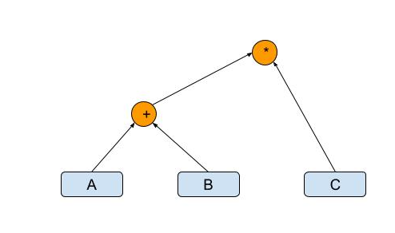

# GraphGrad

Welcome to GraphGrad! GraphGrad is a tensor + automatic differentiation library written in C++/CUDA with Python bindings (a la PyTorch).

This is a term project for CSCI-739 (Topics in Intelligent Systems: Machine Learning Systems Implementation) built by **[Jack Oh](https://github.com/jack8558)**, **[Quinn Tucker](https://github.com/qxzcode)**, and **[Dade Wood](https://github.com/daw1882)**.

## Setup
C++17 compiler must be installed to use Graphgrad.

Set up with conda environment.
Make sure you have miniconda and python3 installed and updated in your machine.
``` shell
-- Create and activate conda env
conda create --name myenv
conda activate myenv

-- Install python packages
pip3 install -r tests/requirement.txt

-- Install cuda-toolkit
conda config --append channels nvidia
conda install cuda-toolkit -c nvidia
```
This will install all the packages needed for python interface.

To compile, simply run:
``` shell
make
```


## How to use
After running make, user should be able to import graphgrad in python

``` py
python3
>>> import graphgrad as gg
>>> tensor1 = gg.tensor([1,2])
>>> tensor1
<Tensor: dims=[2], data=[1.000000, 2.000000]>

```

## How to run with GPU
To use GraphGrad with GPU, user needs to set use_gpu True right after GraphGrad gets imported. 
``` py
>>> import graphgrad as gg
>>> gg.use_gpu(True)
```
After this, all the tensors will be allocated on the GPU, and operations will be executed on the GPU.

User can also set which GPU to use by `gg.set_cuda_device(index)`. 

### Ways to construct tensor
Users can construct the leaf tensor by using following constructors.

- Construct with data: call gg.tensor function with list
``` py
>>> tensor = gg.tensor([[1,2],[3,4]])
>>> tensor
<Tensor: dims=[2, 2], data=[1.000000, 2.000000, 3.000000, 4.000000]>
```
- Construct with random values: pass the dimension as argument and returns tensor with random values
``` py
>>> tensor = gg.rand([2,3])
>>> tensor
<Tensor: dims=[2, 3], data=[0.049640, 0.684461, 0.721733, 0.942821, 0.729735, 0.754699]>
```

### Scalar tensor
You can define scalar tensor like below.
``` py
>>> tensor = gg.tensor(1)
>>> tensor
<Tensor: dims=[], data=[1.000000]>

```


### Supported tensor operations
GraphGrad uses tensor operations to combine tensors and build graphs. For example, let's say we have simple tensor expression '(A + B) * C' where A,B, and C are leaf tensors. You can imagine GraphGrad will build a graph with following nodes.



Here blue rectangle is shown as leaf tensors and orange circles are representing operators that combines tensors.

#### Memory managing: 
Since GraphGrad uses lazy evaluation, it does not evaluate until the eval function is called. Because of this, it accumulates the nodes and constructs the graph until eval is called. Due to this reason, if a user tries to build a super big graph and it does not get evaluated in an intermediate step, it might run into a memory error.

To prevent memory error, it is on user's control to call the function below in appropriate manner.

- gg.eval(tensor1): Forces evaluation of the given tensor and returns a new leaf tensor containing the evaluated data. 

``` py
param = gg.tensor(...)
for _ in _:
    loss = ...
    loss.backward()

    param = gg.eval(param - lr*param.grad)

```

Using `gg.eval` will let user do training iterations without building a huge graph and running out of memory.


- *neg(t)*: Returns a new tensor with the negative of the elements of input tensor.
``` py
>>> tensor = gg.tensor([1,2])
>>> tensor_neg = tensor.neg()
>>> tensor_neg
<Tensor: dims=[2], data=[-1.000000, -2.000000]>

or

>>> tensor_neg = gg.neg(tensor)
>>> tensor_neg
<Tensor: dims=[2], data=[-1.000000, -2.000000]>

```
- *reciprocal*: Returns a new tensor with the reciprocal of the elements of input.
``` py
>>> tensor = gg.tensor([1,2])
>>> tensor_recip = tensor.reciprocal()
>>> tensor_recip
<Tensor: dims=[2], data=[1.000000, 0.500000]>

or

>>> tensor_recip = gg.reciprocal(tensor)
>>> tensor_recip
<Tensor: dims=[2], data=[1.000000, 0.500000]>

```
- *relu*: Returns a new tensor with the rectified linear unit function element-wise.
``` py
>>> tensor = gg.tensor([1,-2])
>>> tensor_relu = tensor.relu()
>>> tensor_relu
<Tensor: dims=[2], data=[1.000000, 0.000000]>

or

>>> tensor_relu = gg.relu(tensor)
>>> tensor_relu
<Tensor: dims=[2], data=[1.000000, 0.000000]>

```
- *binilarize*: Returns a new tensor where element becomes 1 if input element was 1, otherwise 0.
``` py
>>> tensor = gg.tensor([1,-3,-1,100])
>>> tensor_bin = tensor.binilarize()
>>> tensor_bin
<Tensor: dims=[4], data=[1.000000, 0.000000, 0.000000, 1.000000]>

or

>>> tensor_bin = gg.binilarize(tensor)
>>> tensor_bin
<Tensor: dims=[4], data=[1.000000, 0.000000, 0.000000, 1.000000]>
```
- *exp*: Returns a new tensor with the exponential of the elements of the input tensor input.
``` py
>>> tensor = gg.tensor([1,2,3])
>>> tensor_exp = tensor.exp()
>>> tensor_exp
<Tensor: dims=[3], data=[2.718282, 7.389056, 20.085537]>

or

>>> tensor_exp = gg.exp(tensor)
>>> tensor_exp
<Tensor: dims=[3], data=[2.718282, 7.389056, 20.085537]>
```
- *log*: Returns a new tensor with log applied element wise.
``` py
>>> tensor = gg.tensor([1,2])
>>> tensor_log = tensor.log()
>>> tensor_log
<Tensor: dims=[2], data=[0.000000, 0.693147]>

or

>>> tensor_log = gg.log(tensor)
>>> tensor_log
<Tensor: dims=[2], data=[0.000000, 0.693147]>

```
- *transpose(dim0, dim1)*: Returns a new tensor that swap dimension of dim0 and dim1. (NOTE: when using GPU, only supports 2D transpose.)
``` py
>>> tensor = gg.tensor([[1,2,3],[4,5,6],[7,8,9]])
>>> tensor_transpose = tensor.transpose(0,1)
>>> tensor_transpose
<Tensor: dims=[3, 3], data=[1.000000, 4.000000, 7.000000, 2.000000, 5.000000, 8.000000, 3.000000, 6.000000, 9.000000]>

or

>>> tensor_transpose = gg.transpose(tensor,0,1)
>>> tensor_transpose
<Tensor: dims=[3, 3], data=[1.000000, 4.000000, 7.000000, 2.000000, 5.000000, 8.000000, 3.000000, 6.000000, 9.000000]>
```

- *reshape(dims)*: Returns a new reshaped tensor with given dimension.
``` py
>>> tensor = gg.tensor([1,2,3,4,5,6])
>>> tensor_reshape = tensor.reshape([2,3])
>>> tensor_reshape
<Tensor: dims=[2, 3], data=[1.000000, 2.000000, 3.000000, 4.000000, 5.000000, 6.000000]>

or

>>> tensor_reshape = gg.reshape(tensor,[2,3])
>>> tensor_reshape
<Tensor: dims=[2, 3], data=[1.000000, 2.000000, 3.000000, 4.000000, 5.000000, 6.000000]>
```

- *add or +*: Returns a new tensor where element is added elementwise. Also able to do <scalar> + <tensor>. 
``` py
>>> tensor1 = gg.tensor([[1,2],[3,4]])
>>> tensor2 = gg.tensor([[5,6],[7,8]])
>>> tensor_add = tensor1.add(tensor2)
>>> tensor_add
<Tensor: dims=[2, 2], data=[6.000000, 8.000000, 10.000000, 12.000000]>

or

>>> tensor_add = tensor1 + tensor2
>>> tensor_add
<Tensor: dims=[2, 2], data=[6.000000, 8.000000, 10.000000, 12.000000]>
```
- *subtract or -*: Returns a new tensor where element is subtracted elementwise. Also able to do <scalar> - <tensor>. 
``` py
>>> tensor1 = gg.tensor([[1,2],[3,4]])
>>> tensor2 = gg.tensor([[5,6],[7,8]])
>>> tensor_subtract = tensor1.subtract(tensor2)
>>> tensor_subtract
<Tensor: dims=[2, 2], data=[-4.000000, -4.000000, -4.000000, -4.000000]>

or

>>> tensor_subtract = tensor1 - tensor2
>>> tensor_subtract
<Tensor: dims=[2, 2], data=[-4.000000, -4.000000, -4.000000, -4.000000]>

```
- *mul or \**: Returns a new tensor where element is multiplied elementwise. Also able to do <scalar> * <tensor>. 
``` py
>>> tensor1 = gg.tensor([[1,2],[3,4]])
>>> tensor2 = gg.tensor([[5,6],[7,8]])
>>> tensor_mul = tensor1.mul(tensor2)
>>> tensor_mul
<Tensor: dims=[2, 2], data=[5.000000, 12.000000, 21.000000, 32.000000]>

or

>>> tensor_mul = tensor1 * tensor2
>>> tensor_mul
<Tensor: dims=[2, 2], data=[5.000000, 12.000000, 21.000000, 32.000000]>
```

- *div or /*: Returns a new tensor where element is divided elmenetwise. Also able to do <scalar> / <tensor>.
``` py
>>> tensor1 = gg.tensor(2)
>>> tensor2 = gg.tensor([[3,4],[5,6]])
>>> tensor_div = tensor1.div(tensor2)
>>> tensor_div
<Tensor: dims=[2, 2], data=[0.666667, 0.500000, 0.400000, 0.333333]>

or

>>> tensor1 / tensor2
<Tensor: dims=[2, 2], data=[0.666667, 0.500000, 0.400000, 0.333333]>
```

- *matmul*: Performs matrix multiplication. Currently only supports up to 2D tensors for matmul.
``` py
>>> tensor1 = gg.tensor([[1,2],[3,4]])
>>> tensor2 = gg.tensor([[5,6],[7,8]])
>>> tensor_matmul = tensor1.matmul(tensor2)
>>> tensor_matmul
<Tensor: dims=[2, 2], data=[19.000000, 22.000000, 43.000000, 50.000000]>
```

- *pow*: Takes the power of each element in t1 with t2 and returns a tensor with the result.
``` py
>>> tensor1 = gg.tensor([[1,2],[3,4]])
>>> tensor2 = gg.tensor([[5,6],[7,8]])
>>> tensor_pow = tensor1.pow(tensor2)
>>> tensor_pow
<Tensor: dims=[2, 2], data=[1.000000, 64.000000, 2187.000000, 65536.000000]>
```
- *sum*: Returns the sum of all elements in the input tensor.
``` py
>>> tensor1 = gg.tensor([[1,2],[3,4]])
>>> tensor2 = gg.tensor([[5,6],[7,8]])
>>> tensor_sum = tensor1.sum()
>>> tensor_sum
<Tensor: dims=[1], data=[10.000000]>
```

### Computing gradients
- backward: Computes the gradient of current tensor wrt graph leaves. The graph is differentiated using the chain rule. You can only apply bakcward to scalar tensor(sum operator comes handy this case). Calling `.grad` for tensors will show relative gradient.
``` py
>>> tensor1 = gg.tensor([[1,2],[3,4]])
>>> tensor2 = gg.tensor([[5,6],[7,8]])
>>> tensor3 = gg.tensor([[2,2],[2,2]])
>>> tensor_add = tensor1 + tensor2
>>> result = (tensor3 * tensor_add).sum()
>>> result.backward()
>>> result.grad
<Tensor: dims=[], data=[1.000000]>
>>> tensor_add.grad
<Tensor: dims=[2, 2], data=[2.000000, 2.000000, 2.000000, 2.000000]>
>>> tensor3.grad
<Tensor: dims=[2, 2], data=[6.000000, 8.000000, 10.000000, 12.000000]>
>>> tensor2.grad
<Tensor: dims=[2, 2], data=[2.000000, 2.000000, 2.000000, 2.000000]>
>>> tensor1.grad
<Tensor: dims=[2, 2], data=[2.000000, 2.000000, 2.000000, 2.000000]>
```


## Unit test
There are various unit tests that checks if GraphGrad operations are correct. It runs same expressions on both GraphGrad and pytorch and compare the results. Make sure pytest is installed and run following command.
```
pytest
```

## Optimization Techniques
Below are optimization techniques GraphGrad uses

- Lazy Evaluation: GraphGrad uses lazy evaluation, where values are not computed until evaluation functions are called. A node in the graph is evaluated only when needed, which avoids unnecessary computations.
- Taking Advantage of Cache for Matmul: For matmul, GraphGrad creates a temporary buffer for the transposed right matrix for faster memory access and cache utilization.
- CPU Optimization: GraphGrad uses OpenMP to optimize CPU execution with multithreading.
- SIMD: GraphGrad uses SIMD computation for matmul.
- CSE (Common Subexpression Elimination): CSE is implemented, so common subexpressions do not need to be computed again. GraphGrad has an internal hashmap that stores values of tensors that were computed before. If the hashmap exceeds the max capacity, it will remove the least recently used element from the hashmap.
- GPU optimization: When `use_gpu` is set to True by the user, GraphGrad will perform all computations on the GPU. GPU optimization has been applied by executing tensor operations in parallel.

## Classifier
A simple binary logistic logression classifier has been implemented in `tests/logistic_regression_example.py`. The accuracy was compared against sklearn's logistic regression classifier and achieves comparable performance on sklearn's breast_cancer dataset:

    sklearn accuracy: 96.32%
    GrphGrad model accuracy: 93.68%

## Benchmark with Pytorch
Pytorch has been chosen to be a benchmark and below is the comparision with GraphGrad.

### Running
To run the benchmark test, run. To see detail of what is being compared, check tests/benchmark.py.

``` shell
-- Run with CPU
python tests/benchmark.py

-- Run with GPU
python tests/benchmark.py -use_gpu
```

Below are the reusult of benchmark when ran in following machine spec.

### Machine Spec: 
- Intel(R) Xeon(R) CPU E5-2650 v4 @ 2.20GHz
- 48 threads in total (2 sockets, 12 cores per socket, 2 threads per core)
- 251 GB memory
- GPU: Tesla P4

### Result CPU

Test 1:

    GraphGrad time: 0.0042638309532776475
    Torch time: 0.02429886907339096

Test 2:

    GraphGrad time: 0.19860418199095875
    Torch time: 0.02489967504516244

Test 3:

    GraphGrad time: 0.8879164479440078
    Torch time: 0.091006567934528

Test 4:

    GraphGrad time: 8.042721451027319
    Torch time: 0.719514610930346

Test 5 (Special case when there are multiple common subexpression):

    GraphGrad time: 0.06286677299067378
    Torch time: 1.233367821900174

For a very simple case (test1), GraphGrad takes longer than torch. For other larger cases, torch is approximately 10 times faster than GraphGrad. This is a good result considering PyTorch has multiple other optimizations installed internally. 

Test5 is a special case where there are many common subexpressions, and GraphGrad outperforms PyTorch. This example proves that CSE is working as expected since common expression is not being computed again.

### Result GPU
Test 1 finished.

    GraphGrad time: 1.4520762789761648
    Torch time: 0.7352663649944589

Test 2 finished.

    GraphGrad time: 0.13476406293921173
    Torch time: 0.019834927981719375

Test 3 finished.

    GraphGrad time: 0.2010022649774328
    Torch time: 0.0070169949904084206

Test 4 finished.

    GraphGrad time: 2.1655370260123163
    Torch time: 0.482791246031411

Test 5 finished.

        GraphGrad time: 0.35613198298960924
        Torch time: 4.835883064079098

When using GPU for both GraphGrad and torch, GraphGrad was ~4 times slower than pytorch. This result is quite impressive comapred to highly used library like pytroch. For special case in test5, GraphGrad still performs better than pytorch.


